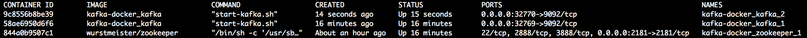
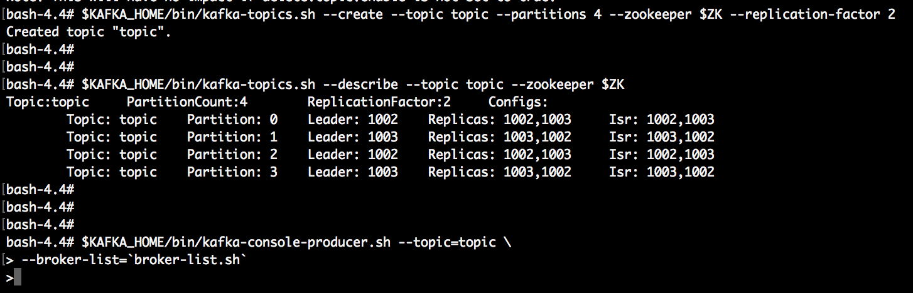
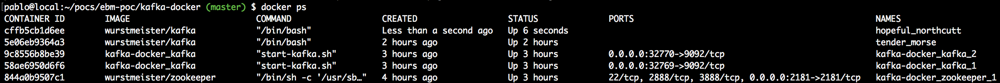

#Events backboned microservices POC

##Preparación
Para poder correr la prueba en un solo host (local) usaremos contenedores **Docker**. Por ser una prueba de concepto limitaremos el número de brokers de Kafka a 2.
1. Clonar este repo y hacer ´cd kafka-docker´
2. Descargar la configuracion de docker-compose necesaria para correr Kafka en Docker (Kafka + Zookeeper) desde https://wurstmeister.github.io/kafka-docker/
3. Modificar el archivo *docker-compose.yml* de acuerdo a lo que dice la documentación. Por ejempo la IP del HOST de docker fue: 172.22.0.1
Adicionalmente agregaremos otro broker para hacer más interesante la prueba
```bash
docker-compose up
docker-compose up --scale kafka=2
```
Haciendo un `docker ps` se debería ver algo similar a esto:


4. Luego para probar crearemos un container que actuará como producer `start-kafka-shell.sh <DOCKER_HOST_IP> <ZK_HOST:ZK_PORT>`, según el ejemplo sería
```bash
./start-kafka-shell.sh 172.22.0.1 172.22.0.1:2181
```
(recordemos que está todo referido al mismo host ya que estamos utilizando la ip de host para los containers docker). Desde este container se pueden correr los test que aparecen en el link:
```bash
$KAFKA_HOME/bin/kafka-topics.sh --create --topic topic \
--partitions 4 --zookeeper $ZK --replication-factor 2
$KAFKA_HOME/bin/kafka-topics.sh --describe --topic topic --zookeeper $ZK
$KAFKA_HOME/bin/kafka-console-producer.sh --topic=topic \
--broker-list=`broker-list.sh`
```
El primer comando crea el topic *topic*, el segundo comando lo describe y el tercero inicia el modo para ingresar mensajes, uno por línea.

Dejamos esta consola como está.

5. Para probar que se consuman necesitamos crear un consumer. Para ello en otra terminal volvemos a ejecutar:
```bash
./start-kafka-shell.sh 172.22.0.1 172.22.0.1:2181
```
Si ejecutamos otro `docker ps` se observa:

En la lista aparecen el *zookeeper*, los dos bokers *kafka*, el *kafka* utilizado recientemente como producer, y el container *kafka* en el que correr el consumer.
Dentro del container nuevo ejecutar:
```bash
$KAFKA_HOME/bin/kafka-console-consumer.sh --topic=topic --zookeeper=$ZK
```
En la consola del producer ingresamos algunos mensajes por línea y comprobamos en la consola del consumer que los mensajes son recibidos.
**El entorno de kafka en docker está listo para probar**


